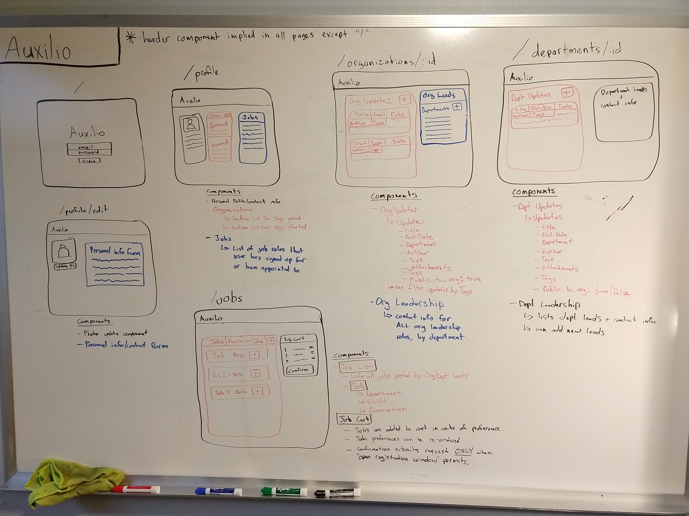
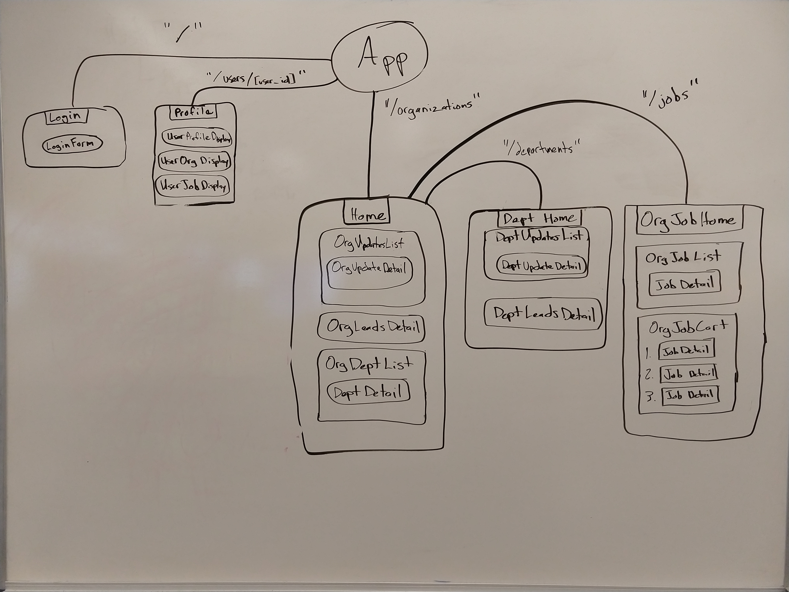

# Auxilio

#### by Robert Bruce

Latest Deployment can be found [here](https://heretoauxilio.firebaseapp.com/?action=#/profile).
This project requires the use of the [Auxilio Api Server](https://github.com/entegral/auxilio-api-server). The latest deployment of this project uses a free Heroku tier, so your login/signup may experience a 4-5 second delay as the dyno wakes from sleep. 

#### This app is a work-in-progress and its back-end will be migrated to AWS' API-Gateway, Lambda and DynamoDB.

## Project Proposal

Auxilio is here to help you manage your workforce. It provides you with a platform to effectively manage and coordinate your constituents. Auxilio accomplishes this through the use of: 
  * Organization of consitituents into **_departments_**
  * Delegation of responsibilities via the promotion of individuals to 'Department Leads' or 'Organization Leads'
  * Custom forms, enabling the collection of information necessary to running your Org
  * Forum/message board to broadcast _**updates**_
      * Updates can contain forms, written content or documents 
      * Updates serve as a clear timeline of communication
      * Updates can only be broadcast by managers and department leads
      * All constituents can comment on an update
  * Job board where Organization and Department Leads can post jobs in one of three ways:
      * Traditional application style
      * Registered for an open-signup process
      * Special appointment

## List the absolute minimum features the project requires to meet this purpose or goal:

* A new user can create a new Organization/Camp/Group or join an existing Org/Camp/Group
  * Upon creation, user becomes "Manager" of the Org/Camp/Group
  * Upon joining an existing group, the Auxilio user is added to that group's "volunteer pool"
* Manager Role Features:
  * Organization Enrollment Policy
  * Manager can establish either an Open or Closed (secret) enrollment process
      * open means any Auxilio user can signup without permission
      * closed means an Auxilio user must have a password to register with the group 
  * Departments
    * Can create, update or delete departments
    * Organizations will always have one default department called "Admins"
    * Members of the Admin department will have permissions equal to the manager role
    * Manager/Admins can appoint one or more users enrolled in the group's volunteer pool to a Department Lead Role
    * Department Lead Roles will have privileges similar to the Manager Role, but within the scope of their department
  * Volunteer Pool Job Signups / Registration Features 
Manager will choose a timeframe that volunteers can self-register for available volunteer shifts / opportunities
manager can override and modify ANY volunteer registration or Department Lead appointment
  * Posting
Only Manager and those in the Admins department can add posts to the Organization's main page 
  * Forms
    * Can create forms necessary for collecting information from users (beyond generic info collected when user registers with Auxilio
    * Can generate reports using information generated by form results
      * Can check status of all registered candidates' form results
      * Can generate reports using all the registered volunteer/camper data
* Department Lead Role:
  * Can create lists of job roles needed for their department
    * Jobs can be labeled as "open for registration" which allows volunteers to sign up for them when the registration window opens
    * if not labeled 'open', the position must be manually assigned with someone from the candidate pool
  * Can make Posts:
    * Can post information about their department to their department-specific page
    * Can post information about their department to the Organization's main page 
  * Forms:
    * Can create forms collecting info from users that are in their department
    * Can create forms collecting info from ALL users in the organization
    * Can generate reports using data collected from these forms
* Candidate Pool Members:
  * Are enrolled with an organization
  * Can update their user information
  * Can update their Organization-specific information
  * Can register for a volunteer job/position during the registration window
  * Can comment on posts made by managers or department leads

### Proposed Project View Layout

### Proposed Project Component Tree

### What tools, frameworks, libraries, APIs, modules and/or other resources (whatever is specific to your track, and your language) will you use to create this MVP? List them all here. Be specific.
* React
* Redux
* Rails
* react-materialize
* Firebase Auth

### If you finish developing the minimum viable product (MVP) with time to spare, what will you work on next? Describe these features here: Be specific.

* manipulation of data with json 'actions' (i.e. generation of reports based on persisted data)
* API Security (JWT)
* Oauth
* cycling API keys
* Code Splitting
* Making a Progressive Web App

### What additional tools, frameworks, libraries, APIs, or other resources will these additional features require?

* Rails controller methods
* Possibly some gems providing a permissions system 

This project was bootstrapped with [Create React App](https://github.com/facebook/create-react-app).

## Create-React-App Info 

### Code Splitting

This section has moved here: https://facebook.github.io/create-react-app/docs/code-splitting

### Analyzing the Bundle Size

This section has moved here: https://facebook.github.io/create-react-app/docs/analyzing-the-bundle-size

### Making a Progressive Web App

This section has moved here: https://facebook.github.io/create-react-app/docs/making-a-progressive-web-app

### Advanced Configuration

This section has moved here: https://facebook.github.io/create-react-app/docs/advanced-configuration

### Deployment

This section has moved here: https://facebook.github.io/create-react-app/docs/deployment

### `npm run build` fails to minify

This section has moved here: https://facebook.github.io/create-react-app/docs/troubleshooting#npm-run-build-fails-to-minify
